# Retinal Vessel Segmentation with MAPLES-DR

A complete pipeline for retinal blood vessel segmentation using deep learning models on the MAPLES-DR dataset (MESSIDOR Anatomical and Pathological Labels for Explainable Screening of Diabetic Retinopathy).

## What This Project Does

This project helps detect blood vessels in retinal images, which is important for diagnosing diabetic retinopathy and other eye diseases. Instead of manually tracing vessels, our AI models can do this automatically.

**Key Features:**
- Downloads and processes MAPLES-DR & MESSIDOR datasets automatically
- Supports both full-image and patch-based training approaches
- Implements U-Net and SegResNet architectures using MONAI
- Multiple loss functions (Dice+CrossEntropy, Dice+Focal)
- Smart inference with sliding-window technique and gaussian blending

## Performance Results

I tested different model configurations on the MAPLES-DR test set to find what works best. Here are the results comparing U-Net vs SegResNet with different training strategies:

**Model Configurations:**
- **U-Net**: 5-layer encoder-decoder with residual connections
  - Channels: [16, 32, 64, 128, 256], Batch normalization
- **SegResNet**: Lighter model with residual blocks  
  - 8 initial filters, variable block depths, Batch normalization

**Results (Dice Score - higher is better):**

| Model         | Training Strategy | Loss Function  | Dice Score        |
|---------------|-------------------|----------------|-------------------|
| U-Net         | Full Image        | Dice+CE        | 0.837 ± 0.028     |
| U-Net         | Patches           | Dice+CE        | 0.827 ± 0.029     |
| U-Net         | Full Image        | Dice+Focal     | 0.838 ± 0.028     |
| U-Net         | Patches           | Dice+Focal     | 0.829 ± 0.028     |
| SegResNet     | Full Image        | Dice+CE        | 0.832 ± 0.047     |
| **SegResNet** | **Patches**       | **Dice+CE**    | **0.844 ± 0.029**  |
| SegResNet     | Full Image        | Dice+Focal     | 0.834 ± 0.048     |
| SegResNet     | Patches           | Dice+Focal     | 0.842 ± 0.029     |

**Winner:** SegResNet with patch-based training and Dice+CE loss achieved the best performance!

*Results computed on held-out test set with 0.6 threshold.*

## Visual Examples

Want to see how well the models work? Check out the best and worst predictions for each configuration:

| Model       | Strategy    | Loss        | Best Result | Worst Result |
|-------------|-------------|-------------|-------------|--------------|
| U-Net       | Full Image  | Dice+CE     | 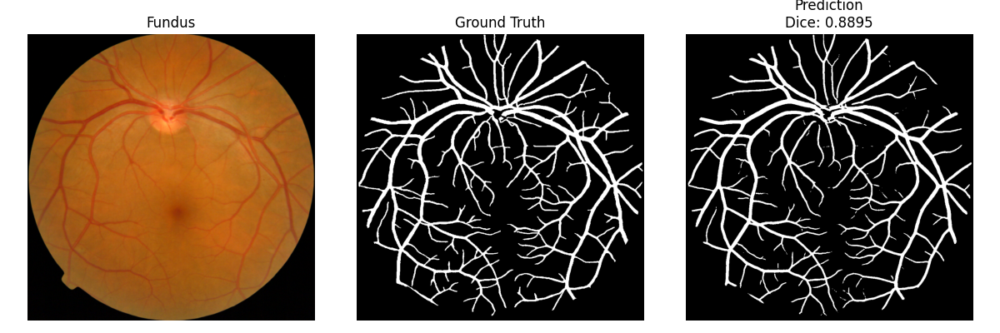 | 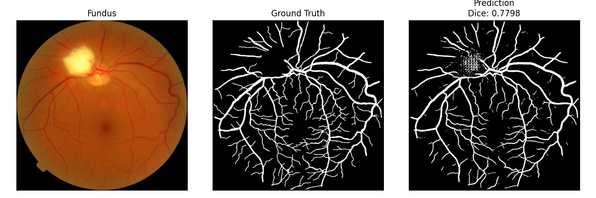 |
| U-Net       | Patches     | Dice+CE     |  | 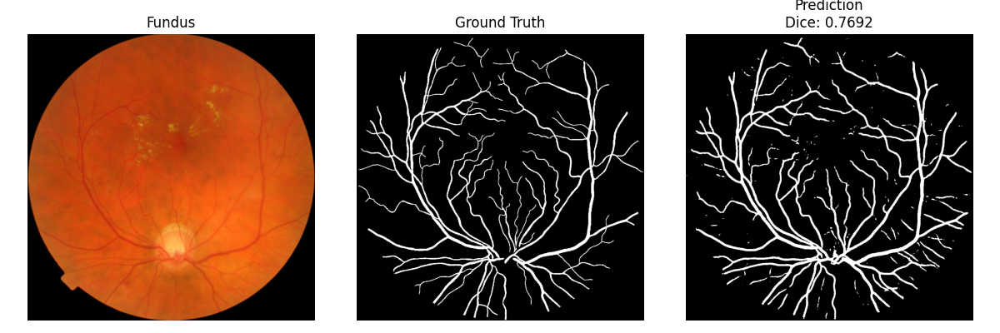 |
| U-Net       | Full Image  | Dice+Focal  | 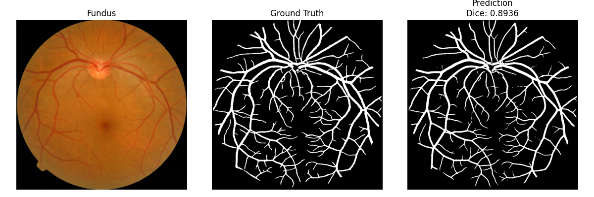 |  |
| U-Net       | Patches     | Dice+Focal  |  | 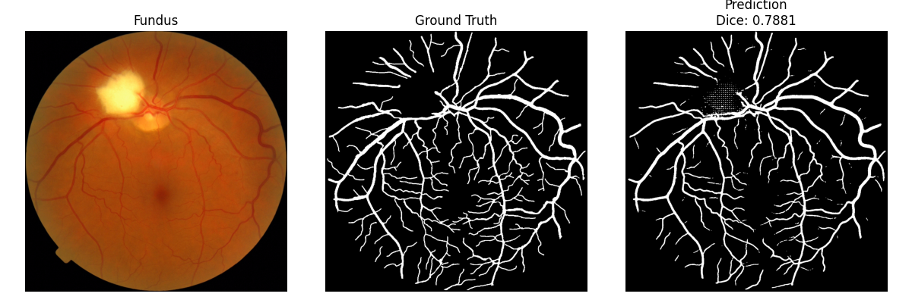 |
| SegResNet   | Full Image  | Dice+CE     |  | 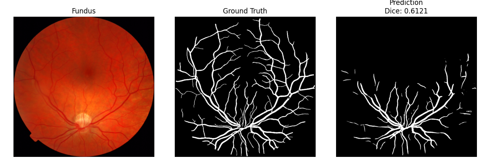 |
| SegResNet   | Patches     | Dice+CE     |  | 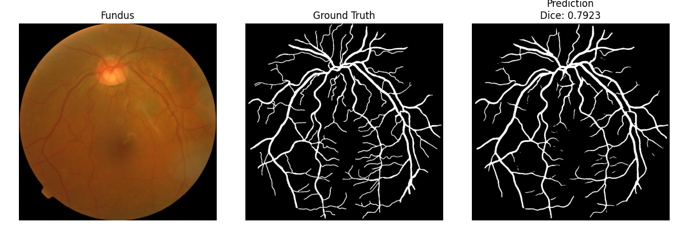 |
| SegResNet   | Full Image  | Dice+Focal  | 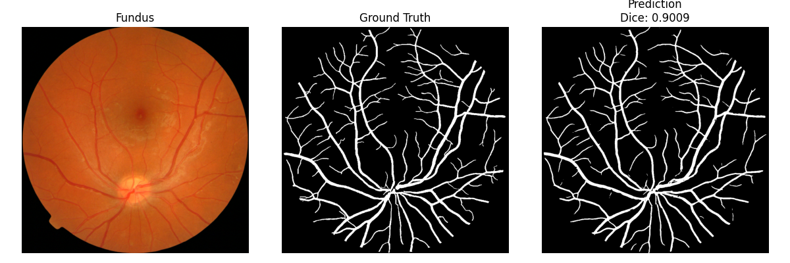 | 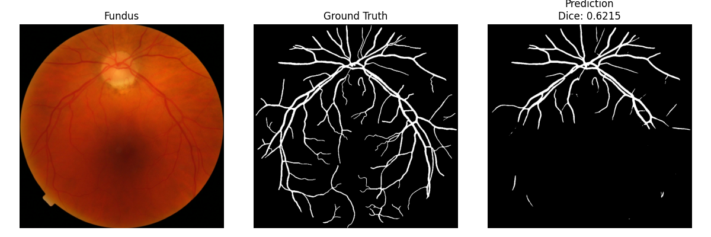 |
| SegResNet   | Patches     | Dice+Focal  | 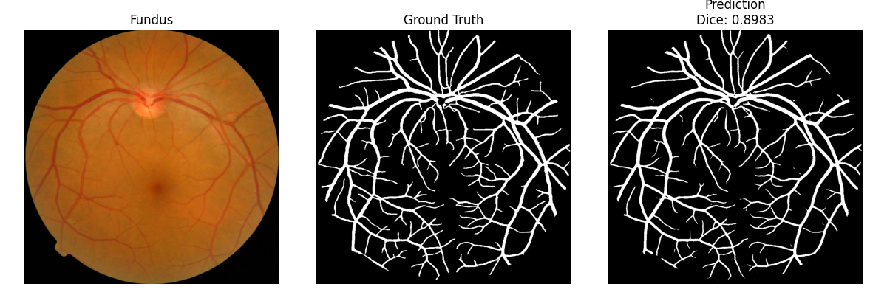 | 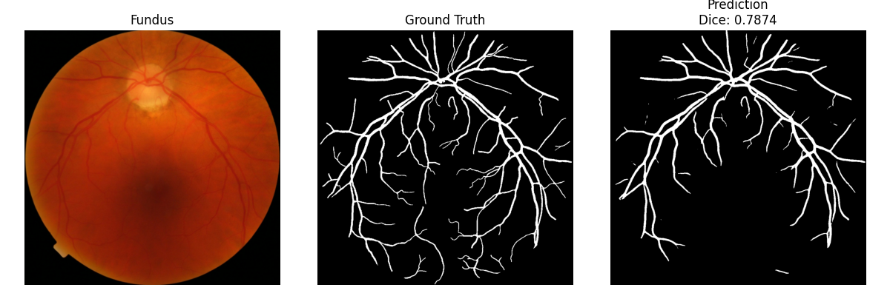 |

## How to Use This Project

### Step 1: Setup

Clone the repository and install everything you need:

```bash
git clone <repo-url>
cd retinal_vessel_segmentation
python src/env_setup.py  # This installs all dependencies and creates folders
```

### Step 2: Get the Data

Download the 12 MESSIDOR zip files (`Base11.zip` to `Base34.zip`) and place them in `data/messidor/`. Then run:

```bash
python src/data_processing/acquisition.py
```

This will automatically extract and organize all the images for you.

### Step 3: Prepare Training Data

Process the images and create training/validation splits:

```bash
python src/data_processing/preprocess.py
```

This creates both full-image and patch-based datasets.

### Step 4: Train Your Model

Create or modify a config file in `configs/` folder, then start training:

```bash
python src/train.py --config configs/your-experiment.yaml
```

### Step 5: Test on New Images

Run inference on single images or batches:

```bash
# Test single image
python src/inference.py --image path/to/your/image.jpg

# Test on 5 random samples
python src/inference.py --batch 5
```

## Project Structure

```
retinal_vessel_segmentation/
├── configs/                    # Experiment configurations
├── data/                      # Dataset storage
├── scripts/
│   └── summarize_results.py   # Analysis tools
├── src/
│   ├── data_processing/
│   │   ├── acquisition.py     # Download & organize data
│   │   └── preprocess.py      # Image preprocessing
│   ├── env_setup.py          # Environment setup
│   ├── config.py             # Configuration management
│   ├── dataset.py            # Data loading
│   ├── model.py              # Neural network models
│   ├── train.py              # Training pipeline
│   ├── evaluate.py           # Model evaluation
│   └── inference.py          # Prediction on new images
└── README.md
```

## License

This project is licensed under the MIT License.


---

## Citation

If you use this project or datasets, please cite the following works:

### MAPLES-DR Dataset

Lareyre, F., Luong, M., Millet, P. et al.  
**MAPLES-DR: MESSIDOR Anatomical and Pathological Labels for Explainable Screening of Diabetic Retinopathy**  
*Scientific Data*, 11, 184 (2024).  
https://doi.org/10.1038/s41597-024-03739-6


### MESSIDOR Dataset

The Messidor database is provided for research and educational purposes only.  
**Please acknowledge** its use as follows:

> Provided by Messidor program partners  
> (see https://www.adcis.net/fr/logiciels-tiers/messidor-fr/ )

If you use the Messidor database in your research, **please cite** the following paper:

Decencière et al.  
**Feedback on a publicly distributed database: the Messidor database**  
*Image Analysis & Stereology*, Vol. 33, No. 3, pp. 231–234, 2014.  
https://doi.org/10.5566/ias.1155

---
