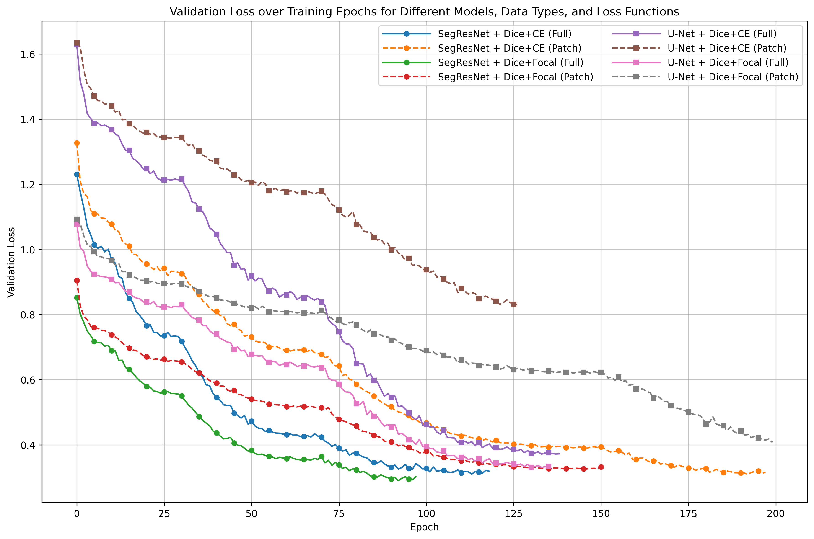

# Retinal Vessel Segmentation with MAPLES-DR

A complete pipeline for retinal blood vessel segmentation using deep learning models on the MAPLES-DR dataset (MESSIDOR Anatomical and Pathological Labels for Explainable Screening of Diabetic Retinopathy).

## What This Project Does

This project helps detect blood vessels in retinal images, which is important for diagnosing diabetic retinopathy and other eye diseases. Instead of manually tracing vessels, our AI models can do this automatically.

**Key Features:**
- Downloads and processes MAPLES-DR & MESSIDOR datasets automatically
- Supports both full-image and patch-based training approaches
- Implements U-Net and SegResNet architectures using MONAI
- Multiple loss functions (Dice+CrossEntropy, Dice+Focal)
- Smart inference with sliding-window technique and gaussian blending

## Performance Results

I tested different model configurations on the MAPLES-DR test set to find what works best. Here are the results comparing U-Net vs SegResNet with different training strategies:

**Model Configurations:**
- **U-Net**: 5-layer encoder-decoder with residual connections
  - Channels: [16, 32, 64, 128, 256], Batch normalization
- **SegResNet**: Lighter model with residual blocks  
  - 8 initial filters, variable block depths, Batch normalization
  
### Validation Loss Comparison Summary

Here’s a concise summary of the best validation‐loss achieved by each configuration (minimized over all epochs), sorted from lowest (best) to highest:

| Model     | Training Data | Loss Function        | Min Val Loss | Epoch |
|-----------|---------------|----------------------|--------------|-------|
| SegResNet | Full images   | Dice + Focal         | 0.2902       | 92    |
| SegResNet | Patch         | Dice + CrossEntropy  | 0.3101       | 192   |
| SegResNet | Full images   | Dice + CrossEntropy  | 0.3108       | 113   |
| SegResNet | Patch         | Dice + Focal         | 0.3262       | 146   |
| U-Net     | Full images   | Dice + Focal         | 0.3309       | 130   |
| U-Net     | Full images   | Dice + CrossEntropy  | 0.3717       | 133   |
| U-Net     | Patch         | Dice + Focal         | 0.4079       | 199   |
| U-Net     | Patch         | Dice + CrossEntropy  | 0.8310       | 121   |

  
*Figure: Validation loss curves.*  

*All early stops in the training logs are due to the built-in early-stopping mechanism. All runs that “stopped early” hit the patience limit of 5 non-improving validation checks and then exited.*
### Key Conclusions

- **SegResNet outperforms U-Net across the board.**  
  For every loss/data combination, SegResNet achieves substantially lower validation loss than U-Net.

- **Full-image training generally outperforms patch-based training.**  
  - The best full-image config (SegResNet + Dice + Focal; 0.2902) beats its patch equivalent by ~0.036.  
  - Patch training tends to overfit: training loss drops more but validation loss plateaus or rises.

- **Dice + Focal loss is most effective on full images.**  
  - SegResNet: Dice + Focal (0.2902) vs. Dice + CE (0.3108).  
  - U-Net: Dice + Focal (0.3309) vs. Dice + CE (0.3717).

- **On patches, Dice + CrossEntropy slightly edges out Dice + Focal—but both lag behind full-image runs.**  
  - SegResNet: CE patch (0.3101) < Focal patch (0.3262).  
  - U-Net: CE patch (0.8310) shows extreme overfitting vs. Focal patch (0.4079).

- **Convergence speed differences.**  
  Full-image Dice + Focal (SegResNet) reaches its minimum by 92 epochs, whereas patch runs usually need 140–200 epochs.

### Overall Recommendation

Use **SegResNet** trained on **full images** with **Dice + Focal** loss for the lowest validation loss and best generalization.  


## Visual Examples

Want to see how well the models work? Check out the best and worst predictions for each configuration:

| Model       | Strategy    | Loss        | Example |
|-------------|-------------|-------------|-------------|
| SegResNet   | Full Image  | Dice+Focal  |  |
| SegResNet   | Patches     | Dice+CE     |  |
| SegResNet   | Full Image  | Dice+CE     |  |
| SegResNet   | Patches     | Dice+Focal  |  |
| U-Net       | Full Image  | Dice+Focal  |  |
| U-Net       | Full Image  | Dice+CE     |  |
| U-Net       | Patches     | Dice+Focal  |  |
| U-Net       | Patches     | Dice+CE     |  |

## How to Use This Project

### Step 1: Setup

Clone the repository and install everything you need:

```bash
git clone <repo-url>
cd retinal_vessel_segmentation
python src/env_setup.py  # This installs all dependencies and creates folders
```

### Step 2: Get the Data

Download the 12 MESSIDOR zip files (`Base11.zip` to `Base34.zip`) and place them in `data/messidor/`. Then run:

```bash
python src/data_processing/acquisition.py
```

This will automatically extract and organize all the images for you.

### Step 3: Prepare Training Data

Process the images and create training/validation splits:

```bash
python src/data_processing/preprocess.py
```

This creates both full-image and patch-based datasets.

### Step 4: Train Your Model

Create or modify a config file in `configs/` folder, then start training:

```bash
python src/train.py --config configs/your-experiment.yaml
```

### Step 5: Test on New Images

Run inference on single images or batches:

```bash
# Test single image
python src/inference.py --image path/to/your/image.jpg

# Test on 5 random samples
python src/inference.py --batch 5
```

## Project Structure

```
retinal_vessel_segmentation/
├── configs/                    # Experiment configurations
├── data/                      # Dataset storage
├── scripts/
│   └── summarize_results.py   # Analysis tools
├── src/
│   ├── data_processing/
│   │   ├── acquisition.py     # Download & organize data
│   │   └── preprocess.py      # Image preprocessing
│   ├── env_setup.py          # Environment setup
│   ├── config.py             # Configuration management
│   ├── dataset.py            # Data loading
│   ├── model.py              # Neural network models
│   ├── train.py              # Training pipeline
│   ├── evaluate.py           # Model evaluation
│   └── inference.py          # Prediction on new images
└── README.md
```

## License

This project is licensed under the MIT License.


---

## Citation

If you use this project or datasets, please cite the following works:

### MAPLES-DR Dataset

Lareyre, F., Luong, M., Millet, P. et al.  
**MAPLES-DR: MESSIDOR Anatomical and Pathological Labels for Explainable Screening of Diabetic Retinopathy**  
*Scientific Data*, 11, 184 (2024).  
https://doi.org/10.1038/s41597-024-03739-6


### MESSIDOR Dataset

The Messidor database is provided for research and educational purposes only.  
**Please acknowledge** its use as follows:

> Provided by Messidor program partners  
> (see https://www.adcis.net/fr/logiciels-tiers/messidor-fr/ )

If you use the Messidor database in your research, **please cite** the following paper:

Decencière et al.  
**Feedback on a publicly distributed database: the Messidor database**  
*Image Analysis & Stereology*, Vol. 33, No. 3, pp. 231–234, 2014.  
https://doi.org/10.5566/ias.1155

---
